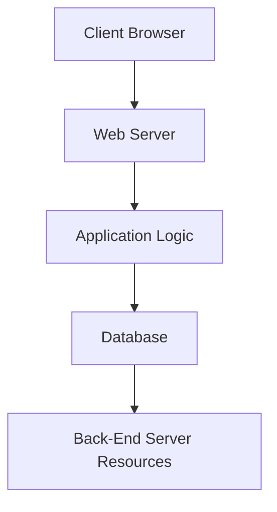
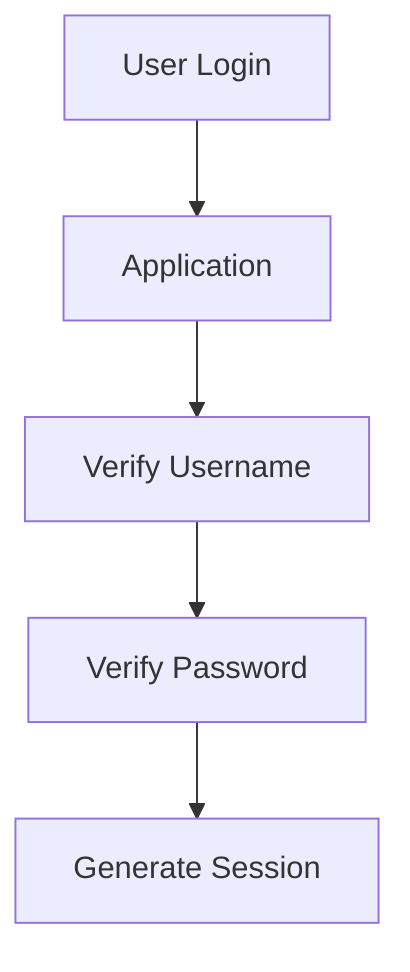

# What is a Back-End Server?

A **Back-End Server** is the actual system (hardware + operating system + software) that hosts and runs a web application.

It processes requests received from users, executes application logic, interacts with databases, and returns responses through the web server.

### Simple Definition

> A back-end server is the real machine that runs all the services, applications, and databases required for a web application to function.

---

# Position in Web Architecture

Recall the three-tier architecture:

```text
Presentation Layer
        ↓
Application Layer
        ↓
Data Access Layer
```

The **Back-End Server** mainly belongs to the:

```text
Data Access Layer
```

but often contains components of both:

- Application Layer
    
- Data Access Layer
    

---

# Overall Architecture

```text
User Browser
      ↓
Front-End
      ↓
Web Server
      ↓
Application
      ↓
Database
      ↓
Back-End Server
```

---

## Visual Overview



---

# Main Components of a Back-End Server

The HTB module identifies three primary software components:

### 1. Web Server

### 2. Database

### 3. Development Framework

---

## Component Overview

```text
Back-End Server
│
├── Web Server
├── Web Application
├── Database
└── Operating System
```

---

# Diagram


---

# 1. Web Server

The web server accepts requests from users and serves web content.

---

## Responsibilities

- Receive HTTP requests
    
- Receive HTTPS requests
    
- Deliver web pages
    
- Handle static files
    
- Forward requests to applications
    
- Manage client connections
    

---

## Common Web Servers

|Web Server|Description|
|---|---|
|Apache|Most popular open-source web server|
|NGINX|High-performance web server and reverse proxy|
|IIS|Microsoft's web server|
|LiteSpeed|Commercial high-performance server|

---

## Example

```text
User Requests:
https://website.com
```

---

Web Server:

```text
Apache
```

receives request and processes it.

---

# Apache Web Server

Popular features:

```text
Open Source
Cross Platform
Module Support
High Compatibility
```

---

# NGINX

Popular features:

```text
Fast
Low Resource Usage
Load Balancing
Reverse Proxy
```

---

# IIS (Internet Information Services)

Created by Microsoft.

Used with:

```text
Windows Servers
ASP.NET
.NET Applications
```

---

# 2. Web Application / Development Framework

Contains business logic.

---

## Responsibilities

Processes:

- User login
    
- Registration
    
- Password changes
    
- Shopping carts
    
- Search functionality
    
- API processing
    

---

### Examples

|Language|Framework|
|---|---|
|PHP|Laravel|
|Python|Django|
|Java|Spring|
|JavaScript|Node.js|
|C#|ASP.NET|
|Ruby|Rails|

---

# Example Workflow

```text
Login Request
      ↓
Application Logic
      ↓
Verify Credentials
      ↓
Database Query
      ↓
Generate Response
```

---

# Application Layer Diagram



---

# 3. Database

The database stores application data.

---

## Common Stored Data

- Users
    
- Password hashes
    
- Products
    
- Orders
    
- Comments
    
- Sessions
    
- Logs
    

---

# Popular Databases

|Database|Type|
|---|---|
|MySQL|Relational|
|MariaDB|Relational|
|PostgreSQL|Relational|
|Oracle|Enterprise|
|Microsoft SQL Server|Enterprise|
|MongoDB|NoSQL|

---

# Database Example

```text
User Login
      ↓
Database Query
      ↓
Check Credentials
      ↓
Result Returned
```

---

# Example SQL Query

```sql
SELECT *
FROM users
WHERE username='admin';
```

---

# Back-End Server Operating Systems

The server itself requires an operating system.

---

# Common Server Operating Systems

### Linux

Most common server OS.

Examples:

- Ubuntu Server
    
- Debian
    
- CentOS
    
- Rocky Linux
    
- AlmaLinux
    

---

### Windows Server

Used with:

- IIS
    
- Active Directory
    
- ASP.NET
    

---

# Diagram

```text
Back-End Server
│
├── Linux
│
└── Windows Server
```

---

# Other Components on Back-End Servers

The HTB module mentions additional technologies.

---

# Hypervisors

A hypervisor allows multiple virtual machines to run on one physical server.

---

## Examples

- VMware ESXi
    
- Hyper-V
    
- KVM
    
- Xen
    

---

### Diagram

```text
Physical Server
       ↓
Hypervisor
       ↓
VM1
VM2
VM3
```

---

# Containers

Containers package applications with their dependencies.

---

## Popular Container Technologies

- Docker
    
- Kubernetes
    
- Podman
    

---

### Benefits

```text
Lightweight
Portable
Scalable
Fast Deployment
```

---

# Container Example

```text
Docker Container
      ↓
Web Application
      ↓
Runs Independently
```

---

# Web Application Firewall (WAF)

A WAF protects web applications from attacks.

---

## Detects

- SQL Injection
    
- XSS
    
- CSRF
    
- Command Injection
    
- File Inclusion
    

---

## Examples

- ModSecurity
    
- Cloudflare WAF
    
- AWS WAF
    
- Azure WAF
    

---

# Diagram

```text
Internet
    ↓
WAF
    ↓
Web Server
    ↓
Application
```

---

# Back-End Technology Stacks

A **stack** is a predefined combination of technologies used together.

---

# LAMP Stack

## Components

|Letter|Component|
|---|---|
|L|Linux|
|A|Apache|
|M|MySQL|
|P|PHP|

---

## Diagram

```text
Linux
  ↓
Apache
  ↓
PHP
  ↓
MySQL
```

---

# LAMP Architecture


---

# WAMP Stack

## Components

|Letter|Component|
|---|---|
|W|Windows|
|A|Apache|
|M|MySQL|
|P|PHP|

---

### Diagram

```text
Windows
   ↓
Apache
   ↓
PHP
   ↓
MySQL
```

---

# WINS Stack

## Components

|Letter|Component|
|---|---|
|W|Windows|
|I|IIS|
|N|.NET|
|S|SQL Server|

---

### Diagram

```text
Windows
   ↓
IIS
   ↓
.NET
   ↓
SQL Server
```

---

# MAMP Stack

## Components

|Letter|Component|
|---|---|
|M|macOS|
|A|Apache|
|M|MySQL|
|P|PHP|

---

### Common Usage

Mostly development environments.

---

# XAMPP Stack

## Components

|Letter|Component|
|---|---|
|X|Cross Platform|
|A|Apache|
|M|MySQL|
|P|PHP / PERL|

---

## Benefits

```text
Works on:
Windows
Linux
macOS
```

---

# Hardware in Back-End Servers

The back-end server contains all physical resources.

---

## CPU

Responsible for:

```text
Processing Requests
Running Applications
Database Queries
```

---

## RAM

Stores active processes.

More RAM:

```text
More Users
Better Performance
```

---

## Storage

Stores:

- Databases
    
- Logs
    
- Applications
    
- Backups
    

---

### Storage Types

```text
HDD
SSD
NVMe
```

---

## Network Interface

Handles:

```text
Incoming Requests
Outgoing Responses
```

---

# Importance of Hardware

Better hardware means:

✅ Faster responses

✅ More concurrent users

✅ Better stability

✅ Higher availability

---

# Modern Infrastructure

Large web applications rarely run on one server.

Instead:

```text
Multiple Servers
       +
Load Balancers
       +
Cloud Services
```

---

# Traditional Architecture

```text
Single Server
      ↓
Everything Runs Here
```

---

# Modern Architecture

```text
Load Balancer
      ↓
Server 1
Server 2
Server 3
```

---

# Cloud Hosting

Most modern applications use cloud providers.

---

## Popular Providers

- Amazon Web Services
    
- Microsoft Azure
    
- Google Cloud Platform
    
- DigitalOcean
    

---

# Benefits of Cloud Hosting

```text
Scalability
High Availability
Backups
Load Distribution
Disaster Recovery
```

---

# Data Centers

Large providers host applications inside dedicated facilities.

---

## Data Center Provides

- Power
    
- Cooling
    
- Networking
    
- Physical Security
    
- Redundancy
    

---

# Complete Back-End Server Flow

```text
User Browser
      ↓
Web Server
      ↓
Application Framework
      ↓
Database
      ↓
Server Hardware
      ↓
Response Generated
      ↓
Browser
```

---

# Important HTB Exam Points

### Remember

✅ Back-End Server = Hardware + OS + Software

✅ Main Components:

- Web Server
    
- Development Framework
    
- Database
    

✅ Common Web Servers:

- Apache
    
- NGINX
    
- IIS
    

✅ Common Databases:

- MySQL
    
- SQL Server
    
- Oracle
    
- PostgreSQL
    

✅ Common Stacks:

|Stack|Components|
|---|---|
|LAMP|Linux + Apache + MySQL + PHP|
|WAMP|Windows + Apache + MySQL + PHP|
|WINS|Windows + IIS + .NET + SQL Server|
|MAMP|macOS + Apache + MySQL + PHP|
|XAMPP|Cross-Platform + Apache + MySQL + PHP/PERL|

✅ Additional Components:

- Hypervisors
    
- Containers
    
- WAFs
    

✅ Modern Applications:

```text
Do NOT run on a single server
```

Instead use:

```text
Cloud Infrastructure
Load Balancers
Multiple Back-End Servers
```

---

# Quick Revision (1 Minute)

```text
Back-End Server

Definition:
Server that hosts and runs
all web application components.

Contains:
• Operating System
• Web Server
• Application Framework
• Database

Popular Web Servers:
• Apache
• NGINX
• IIS

Popular Databases:
• MySQL
• SQL Server
• Oracle
• PostgreSQL

Popular Stacks:
• LAMP
• WAMP
• WINS
• MAMP
• XAMPP

Extra Components:
• Containers
• Hypervisors
• WAFs

Modern Hosting:
• Cloud
• Data Centers
• Load Balancers
• Multiple Servers
```

This covers all important HTB concepts while preserving the stack combinations, architecture details, hardware components, and exam-relevant points.