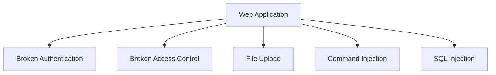
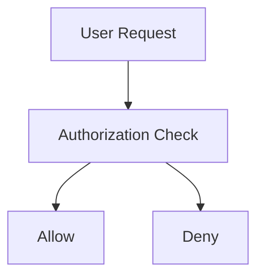

# What Are Web Vulnerabilities?

**Web Vulnerabilities** are weaknesses in a web application that attackers can exploit to gain unauthorized access, steal data, execute code, bypass authentication, or take control of systems.

These vulnerabilities may exist because of:

- Poor coding practices
    
- Improper input validation
    
- Misconfigurations
    
- Weak authentication mechanisms
    
- Insecure file handling
    

### Simple Definition

> A web vulnerability is a flaw that allows an attacker to perform actions that were not intended by the application's developers.

---

# Why Are Web Vulnerabilities Important?

During:

- Penetration Testing
    
- Bug Bounty Hunting
    
- Red Teaming
    
- Web Application Assessments
    

You will frequently encounter vulnerabilities from the **OWASP Top 10**.

These vulnerabilities often lead to:

```text
Account Takeover
      ↓
Data Breach
      ↓
Server Compromise
      ↓
Full System Control
```

---

# Common HTB Vulnerabilities

The module focuses on four major categories:

```text
1. Broken Authentication
2. Broken Access Control
3. Malicious File Upload
4. Command Injection
5. SQL Injection
```

---

# Vulnerability Overview



---

# 1. Broken Authentication

## Definition

Broken Authentication occurs when attackers can bypass authentication mechanisms and access accounts without valid credentials.

### Simple Definition

> Authentication controls fail, allowing unauthorized users to log in.

---

# Normal Authentication

```text
Username
+
Password
      ↓
Validation
      ↓
Login
```

---

# Broken Authentication

```text
No Valid Credentials
         ↓
Authentication Bypass
         ↓
Login Successful
```

---

# Impact

Attackers may:

✅ Access User Accounts

✅ Access Administrator Accounts

✅ Bypass Login Pages

✅ Take Over Systems

---

# HTB Example

The module references:

```text
College Management System 1.2
```

with an authentication bypass vulnerability.

---

### Example Payload (from HTB)

```sql
' or 0=0 #
```

---

### Result

```text
Authentication Check
        ↓
Always True
        ↓
Login Successful
```

---

# Visualization


---

# Broken Authentication Causes

### Weak Session Management

```text
Predictable Session IDs
```

---

### Weak Password Policies

```text
123456
password
admin
```

---

### Improper Validation

```text
Authentication Logic Errors
```

---

# Prevention

✅ Multi-Factor Authentication (MFA)

✅ Strong Password Policies

✅ Secure Session Management

✅ Account Lockout Controls

---

# 2. Broken Access Control

## Definition

Broken Access Control occurs when users can access resources or functions they should not have permission to access.

---

# Example

Normal User:

```text
Can Access:
Profile
Settings
Dashboard
```

---

Administrator:

```text
Can Access:
Admin Panel
User Management
System Settings
```

---

# Vulnerable Scenario

```text
Normal User
      ↓
Admin URL
      ↓
Access Granted
```

---

# Impact

Attackers may:

- Access Admin Panels
    
- View Sensitive Data
    
- Modify User Accounts
    
- Escalate Privileges
    

---

# Access Control Flow



---

# Prevention

✅ Role-Based Access Control (RBAC)

✅ Server-Side Authorization Checks

✅ Least Privilege Principle

---

# Broken Authentication vs Access Control

|Feature|Authentication|Access Control|
|---|---|---|
|Identity Verification|Yes|No|
|Permission Verification|No|Yes|
|Login Bypass|Yes|No|
|Admin Panel Access|Sometimes|Yes|

---

# 3. Malicious File Upload

## Definition

Occurs when users can upload files that should not be allowed.

---

# Normal Upload

```text
image.jpg
document.pdf
```

---

# Malicious Upload

```text
shell.php
```

or

```text
backdoor.jsp
```

---

# Attack Flow

```text
Upload File
      ↓
Server Stores File
      ↓
Server Executes File
      ↓
Attacker Gains Access
```

---

# HTB Example

The module references:

```text
Responsive Thumbnail Slider 1.0
```

---

### Vulnerability

Allowed upload of:

```text
shell.php.jpg
```

(Double Extension)

---

# Why Double Extensions Work

Validation checks:

```text
.jpg
```

---

Server executes:

```text
.php
```

---

Result:

```text
Code Execution
```

---

# Visualization


---

# Common Dangerous Extensions

```text
.php
.jsp
.asp
.aspx
.cgi
.pl
.py
```

---

# Prevention

✅ Allowlist Extensions

✅ MIME-Type Validation

✅ Store Uploads Outside Web Root

✅ Rename Uploaded Files

✅ Disable Script Execution

---

# 4. Command Injection

## Definition

Occurs when user input is passed to an operating system command without proper sanitization.

---

# Example Scenario

Application:

```text
Install Plugin
```

---

Developer executes:

```text
download plugin_name
```

---

User controls:

```text
plugin_name
```

---

# Vulnerable Flow

```text
User Input
      ↓
OS Command
      ↓
Command Executed
```

---

# HTB Example

Module references:

```text
Plainview Activity Monitor
20161228
```

---

### Vulnerable Parameter

```text
ip
```

---

### Attack Concept

Appending:

```text
| COMMAND
```

causes an additional command to execute.

---

# Impact

Attackers may:

✅ Execute OS Commands

✅ Read Files

✅ Download Malware

✅ Gain Reverse Shell

✅ Fully Compromise Server

---

# Visualization

---

# Prevention

✅ Input Validation

✅ Input Sanitization

✅ Avoid System Calls

✅ Use Safe APIs

---

# 5. SQL Injection (SQLi)

## Definition

SQL Injection occurs when user input is included in SQL queries without proper sanitization.

---

# HTB Example Code

```php
$query =
"select * from users
where name like
'%$searchInput%'";
```

---

# Why Vulnerable?

User input becomes part of SQL query.

---

# Data Flow

```text
User Input
      ↓
SQL Query
      ↓
Database
```

---

# SQL Injection Flow

```text
User Input
      ↓
Malicious SQL
      ↓
Database Executes Query
      ↓
Unauthorized Access
```

---

# Visualization

---

# Impact

Attackers may:

✅ Bypass Authentication

✅ Read Database Data

✅ Modify Records

✅ Delete Data

✅ Gain Server Access

---

# Authentication Bypass Example

The module references:

```text
College Management System 1.2
```

where an injected condition always evaluates true.

---

Result:

```text
Login Successful
Without Valid Credentials
```

---

# SQL Injection Categories

### Authentication Bypass

```text
Login Page
```

---

### Data Extraction

```text
Users
Passwords
Emails
```

---

### Privilege Escalation

```text
Gain Admin Access
```

---

### Remote Code Execution

Possible in certain database configurations.

---

# Prevention

✅ Parameterized Queries

✅ Prepared Statements

✅ ORM Usage

✅ Input Validation

✅ Least Privilege Database Accounts

---

# Vulnerability Severity Comparison

|Vulnerability|Impact|
|---|---|
|Broken Authentication|High|
|Broken Access Control|Critical|
|Malicious File Upload|Critical|
|Command Injection|Critical|
|SQL Injection|Critical|

---

# Attack Chain Example

```text
SQL Injection
      ↓
Authentication Bypass
      ↓
Admin Access
      ↓
File Upload
      ↓
Web Shell
      ↓
Command Execution
      ↓
Server Compromise
```

---

# OWASP Relationship

Most of these vulnerabilities fall into categories within the:

OWASP Top 10.

---

# Quick Recognition Guide

|Symptom|Possible Vulnerability|
|---|---|
|Login Bypass|Broken Authentication / SQLi|
|Admin Access as User|Broken Access Control|
|Upload PHP File|File Upload|
|Execute Server Commands|Command Injection|
|Database Manipulation|SQL Injection|

---

# Important HTB Exam Points

### Remember

✅ Broken Authentication

```text
Bypass Login
```

---

✅ Broken Access Control

```text
Access Unauthorized Resources
```

---

✅ Malicious File Upload

```text
Upload Executable Scripts
```

---

✅ Command Injection

```text
Execute OS Commands
```

---

✅ SQL Injection

```text
Execute SQL Queries
```

---

✅ Common Results

```text
Account Takeover
Database Access
Privilege Escalation
Server Compromise
```

---

# Quick Revision (1 Minute)

```text
COMMON WEB VULNERABILITIES

1. Broken Authentication
   → Login Bypass

2. Broken Access Control
   → Unauthorized Access

3. Malicious File Upload
   → Upload Web Shell

4. Command Injection
   → Execute OS Commands

5. SQL Injection
   → Execute SQL Queries

Impacts:
• Account Takeover
• Data Theft
• Privilege Escalation
• Remote Code Execution
• Full Server Compromise

Prevention:
• Input Validation
• Input Sanitization
• Access Controls
• Prepared Statements
• Secure File Uploads
```

