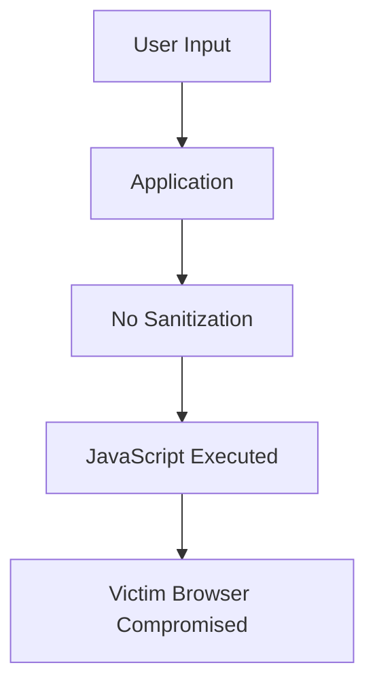

# What is Cross-Site Scripting (XSS)?

**Cross-Site Scripting (XSS)** is a client-side code injection vulnerability that occurs when an attacker can inject malicious **JavaScript** into a web application and have it executed in another user's browser.

XSS is one of the most common and dangerous web vulnerabilities because it allows attackers to execute code within a victim's browser session.

### Simple Definition

> XSS occurs when untrusted user input is interpreted and executed as JavaScript by a user's browser.

---

# Relationship Between HTML Injection and XSS

HTML Injection and XSS are closely related.

### HTML Injection

```html
<h1>Hacked</h1>
```

Browser renders HTML.

---

### XSS

```html
<script>
alert('Hacked');
</script>
```

Browser executes JavaScript.

---

## Visual Comparison

```text
HTML Injection
     ↓
Inject HTML Tags
     ↓
Modify Appearance

XSS
     ↓
Inject JavaScript
     ↓
Execute Code
```

---

# Why is XSS Dangerous?

Once JavaScript executes in the victim's browser, an attacker may:

- Steal session cookies
    
- Hijack user accounts
    
- Perform actions as the victim
    
- Redirect users to malicious sites
    
- Capture keystrokes
    
- Display fake login pages
    
- Modify website content
    
- Perform phishing attacks
    
- Access sensitive browser data
    

---

# How XSS Works

## Normal Request

```text
User Input
    ↓
Validation/Sanitization
    ↓
Display as Text
    ↓
Safe
```

---

## Vulnerable Request

```text
User Input
    ↓
No Filtering
    ↓
Browser Interprets as JavaScript
    ↓
Code Executes
```

---

## Visualization



---

# Types of XSS

HTB identifies **three main types** of XSS:

|Type|Description|
|---|---|
|Reflected XSS|User input is immediately reflected back to the page|
|Stored XSS|User input is stored in the database and later displayed|
|DOM XSS|User input is directly processed by JavaScript and inserted into the DOM|

---

# 1. Reflected XSS

## Definition

Occurs when user input is:

1. Sent to the server
    
2. Processed
    
3. Reflected back in the response
    

without proper sanitization.

---

## Example

Search Page:

```text
https://site.com/search?q=test
```

Page Output:

```html
You searched for: test
```

---

### Malicious Request

```text
https://site.com/search?q=<script>alert(1)</script>
```

---

### Result

```html
You searched for:
<script>alert(1)</script>
```

Browser executes:

```javascript
alert(1)
```

---

## Flow

```text
Attacker
   ↓
Crafts URL
   ↓
Victim Opens URL
   ↓
Server Reflects Payload
   ↓
JavaScript Executes
```

---

# Reflected XSS Diagram

---

# 2. Stored XSS

## Definition

Occurs when malicious input is:

1. Submitted
    
2. Stored in a database
    
3. Displayed later to users
    

without sanitization.

---

## Example

Comment Section:

```text
Comment:
Great post!
```

Stored in database.

---

### Attacker Comment

```html
<script>
alert('Stored XSS');
</script>
```

---

### What Happens?

```text
Attacker Posts Comment
         ↓
Database Stores Payload
         ↓
Other Users View Page
         ↓
JavaScript Executes
```

---

# Why Stored XSS is More Dangerous

Stored XSS:

- Affects every visitor
    
- Doesn't require clicking a malicious link
    
- Can spread automatically
    
- Can affect thousands of users
    

---

# Stored XSS Diagram


---

# 3. DOM XSS

## Definition

Occurs when JavaScript on the page directly inserts user-controlled data into the DOM.

The vulnerability exists entirely in the browser.

---

## Example

```javascript
document.getElementById("output").innerHTML =
location.hash;
```

---

### Vulnerable Input

```text
#
```

---

### Result

```javascript
alert(1)
```

executes immediately.

---

# HTB Example

The vulnerable code:

```javascript
document.getElementById("output").innerHTML =
"Your name is " + input;
```

---

Because:

```javascript
innerHTML
```

is being used, user input becomes part of the page's DOM.

---

# HTB DOM XSS Payload

**Important Payload (keep as provided):**

```javascript
#">
```

---

## What Does It Do?

### Step 1

Creates an image:

```html

```

---

### Step 2

Forces an error event:

```html
onerror=
```

When the image fails loading.

---

### Step 3

Executes JavaScript:

```javascript
alert(document.cookie)
```

---

### Step 4

Displays cookie value.

Example:

```text
session=abc123xyz
```

inside a popup.

---

# Visualization of the Attack

```text
User Input
     ↓
DOM Updated
     ↓
Browser Parses HTML
     ↓
onerror Triggered
     ↓
JavaScript Executes
     ↓
Cookie Displayed
```

---

# HTB Demonstration

### Payload

```html
#">
```

---

### Result

Dialog box appears:

```text
+--------------------+
| session=abc123xyz |
+--------------------+
```

The browser executes:

```javascript
document.cookie
```

and displays the session cookie.

---

# What is document.cookie?

JavaScript object:

```javascript
document.cookie
```

contains cookies associated with the current page.

Example:

```text
sessionid=4f8c3ad9
```

Cookies often contain:

- Session IDs
    
- Authentication tokens
    
- Tracking identifiers
    

---

# Why Cookie Theft is Dangerous

Attack Flow:

```text
Victim Logs In
       ↓
Receives Session Cookie
       ↓
Attacker Steals Cookie
       ↓
Uses Cookie
       ↓
Authenticated as Victim
```

---

## Session Hijacking

If the session cookie is valid:

```text
Cookie Theft
      ↓
Session Reuse
      ↓
Account Takeover
```

---

# XSS Attack Chain

```text
XSS Payload
      ↓
JavaScript Executes
      ↓
Steal Cookie
      ↓
Send Cookie to Attacker
      ↓
Session Hijacking
      ↓
Account Compromise
```

---

# Other Things XSS Can Do

### Redirect Users

```javascript
window.location=
"https://evil.com";
```

---

### Fake Login Form

```html
<form>
Username
<input>

Password
<input type="password">
</form>
```

---

### Keylogging

Capture user keystrokes.

---

### Modify Page Content

```javascript
document.body.innerHTML=
"<h1>Hacked</h1>";
```

---

### Phishing

Display fake:

- Login pages
    
- Payment forms
    
- Security alerts
    

---

# Root Cause of XSS

Most commonly:

```javascript
innerHTML
```

is used with untrusted data.

---

### Dangerous

```javascript
element.innerHTML =
userInput;
```

---

### Safe

```javascript
element.textContent =
userInput;
```

---

# Why innerHTML is Dangerous

### Example

Input:

```html
<h1>Hello</h1>
```

---

Using:

```javascript
innerHTML
```

Output:

# Hello

(rendered)

---

Using:

```javascript
textContent
```

Output:

```text
<h1>Hello</h1>
```

(displayed as text)

---

# Prevention Techniques

## 1. Input Validation

Allow only expected characters.

Example:

```javascript
/^[a-zA-Z ]+$/
```

---

## 2. Output Encoding

Convert:

```html
<
>
"
'
&
```

Into:

```html
&lt;
&gt;
&quot;
&#39;
&amp;
```

---

## 3. Avoid innerHTML

Bad:

```javascript
innerHTML
```

Good:

```javascript
textContent
```

---

## 4. Sanitize User Input

Remove dangerous tags:

```html
<script>
<iframe>
<object>
<embed>
```

---

## 5. HTTPOnly Cookies

Prevents JavaScript from reading cookies.

Example:

```http
Set-Cookie:
session=123;
HttpOnly
```

Then:

```javascript
document.cookie
```

cannot access that cookie.

---

## 6. Content Security Policy (CSP)

Restricts what scripts can execute.

Example:

```http
Content-Security-Policy:
default-src 'self';
```

---

# HTML Injection vs XSS

|Feature|HTML Injection|XSS|
|---|---|---|
|Inject HTML|✅|Sometimes|
|Execute JavaScript|❌|✅|
|Deface Website|✅|✅|
|Steal Cookies|❌|✅|
|Session Hijacking|❌|✅|
|Account Takeover|❌|✅|
|Severity|Medium|High|

---

# Important HTB Exam Points

### Remember

✅ XSS = JavaScript Injection

✅ Often originates from HTML Injection

✅ Main Types:

- Reflected XSS
    
- Stored XSS
    
- DOM XSS
    

✅ HTB Payload:

```javascript
#">
```

✅ Vulnerable Function:

```javascript
innerHTML
```

✅ Cookie Access:

```javascript
document.cookie
```

✅ Main Impact:

- Cookie theft
    
- Session hijacking
    
- Account takeover
    
- Phishing
    
- Browser compromise
    

✅ Prevention:

- Input Validation
    
- Output Encoding
    
- Sanitization
    
- CSP
    
- HTTPOnly Cookies
    
- Use `textContent` instead of `innerHTML`
    

---

# Quick Revision (1 Minute)

```text
Cross-Site Scripting (XSS)

Definition:
JavaScript Injection Vulnerability

Types:
1. Reflected XSS
2. Stored XSS
3. DOM XSS

HTB Payload:
#">

Dangerous Function:
innerHTML

Cookie Access:
document.cookie

Impact:
• Cookie Theft
• Session Hijacking
• Account Takeover
• Phishing
• Defacement

Fix:
• Validate Input
• Sanitize Data
• Encode Output
• CSP
• HTTPOnly Cookies
• textContent instead of innerHTML
```

This preserves the important HTB content (including the DOM XSS payload and explanation) while expanding it into comprehensive study notes suitable for revision and certification preparation.