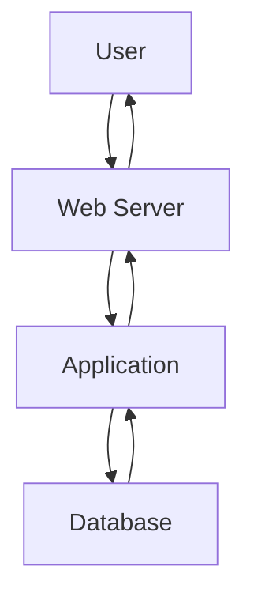
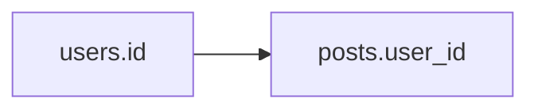
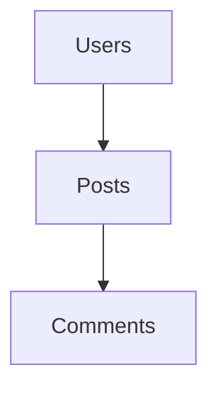

# What is a Database?

A **Database** is a structured storage system used by web applications to store, manage, organize, and retrieve data efficiently.

Without databases, modern web applications would not be able to:

- Store user accounts
    
- Save passwords
    
- Store posts/comments
    
- Maintain sessions
    
- Save uploaded files
    
- Track orders and payments
    

### Simple Definition

> A database is a system that stores information so web applications can quickly retrieve and update it.

---

# Why Do Web Applications Need Databases?

Web applications constantly need to:

```text
Store Data
     ↓
Retrieve Data
     ↓
Modify Data
     ↓
Delete Data
```

Examples:

|Web Application|Stored Data|
|---|---|
|Facebook|Users, Posts, Comments|
|Amazon|Products, Orders, Payments|
|Instagram|Photos, Users, Followers|
|Banking App|Accounts, Transactions|

---

# Database Position in Web Architecture

```text
Client Browser
       ↓
Web Server
       ↓
Application
       ↓
Database
```

---

## Data Flow



---

# What Can Databases Store?

Databases store:

### User Data

```text
Username
Password Hashes
Emails
Phone Numbers
```

---

### Application Content

```text
Posts
Comments
Messages
Notifications
```

---

### Media Files

```text
Images
Videos
Documents
```

---

### Business Data

```text
Orders
Invoices
Transactions
Logs
```

---

# Types of Databases

The HTB module focuses on two major categories:

```text
Databases
│
├── Relational (SQL)
│
└── Non-Relational (NoSQL)
```

---

# Relational Databases (SQL)

## Definition

Relational databases store data in:

- Tables
    
- Rows
    
- Columns
    

Relationships are created between tables using keys.

---

# SQL Database Structure

Example:

### Users Table

|id|username|first_name|last_name|
|---|---|---|---|
|1|admin|John|Smith|
|2|user1|Jane|Doe|

---

### Posts Table

|id|user_id|date|content|
|---|---|---|---|
|1|1|01-01-2021|Hello World|
|2|2|02-01-2021|My First Post|

---

# Visualization


---

# Primary Keys

A **Primary Key** uniquely identifies each row.

Example:

```text
users.id
```

|id|username|
|---|---|
|1|admin|
|2|user1|

No duplicate IDs allowed.

---

# Foreign Keys

A **Foreign Key** links tables together.

Example:

```text
posts.user_id
```

references:

```text
users.id
```

---

# Relationship Example

```text
users.id
      ↓
posts.user_id
```

---

## Diagram



---

# What is a Schema?

### HTB Important Definition

> The relationship between tables inside a database is called a **Schema**.

---

# Example Schema

```text
Users
   ↓
Posts
   ↓
Comments
```

---

## Visualization



---

# Advantages of SQL Databases

✅ Fast Queries

✅ Structured Data

✅ Data Integrity

✅ Relationships

✅ Reliable

✅ Mature Technology

---

# Popular SQL Databases

---

## 1. MySQL

### HTB Notes

- Most common database on the internet
    
- Open Source
    
- Free
    

Used by many PHP applications.

---

### Features

```text
Fast
Reliable
Easy to Learn
Large Community
```

---

## 2. Microsoft SQL Server (MSSQL)

### HTB Notes

Microsoft's relational database.

Commonly used with:

```text
Windows Server
IIS
ASP.NET
```

---

### Features

```text
Enterprise Ready
Active Directory Integration
Microsoft Ecosystem
```

---

## 3. Oracle Database

### HTB Notes

Designed for large enterprises.

---

### Features

```text
Very Reliable
Advanced Features
High Performance
```

---

### Drawback

```text
Expensive
```

---

## 4. PostgreSQL

### HTB Notes

Open-source relational database.

Designed to be:

```text
Extensible
Flexible
Feature Rich
```

---

### Features

```text
Advanced SQL
High Reliability
Strong Security
```

---

# Other SQL Databases

- SQLite
    
- MariaDB
    
- Amazon Aurora
    
- Azure SQL
    

---

# SQL Database Comparison

|Database|Cost|Popularity|
|---|---|---|
|MySQL|Free|Very High|
|MSSQL|Paid|High|
|Oracle|Expensive|Enterprise|
|PostgreSQL|Free|High|

---

# Non-Relational Databases (NoSQL)

## Definition

NoSQL databases do NOT use:

❌ Tables

❌ Rows

❌ Columns

❌ Relationships

❌ Schemas

---

Instead, they use flexible storage models.

---

# Why NoSQL?

Useful when data is:

```text
Large
Unstructured
Rapidly Changing
Highly Scalable
```

---

# SQL vs NoSQL

|Feature|SQL|NoSQL|
|---|---|---|
|Tables|Yes|No|
|Fixed Schema|Yes|No|
|Relationships|Yes|No|
|Scalability|Moderate|Excellent|
|Flexibility|Lower|High|

---

# NoSQL Storage Models

HTB identifies four models:

```text
1. Key-Value
2. Document-Based
3. Wide-Column
4. Graph
```

---

# 1. Key-Value Model

Stores data as:

```text
Key → Value
```

---

Example:

```json
{
  "100001":"Welcome",
  "100002":"First Post",
  "100003":"Reminder"
}
```

---

## Visualization

```text
100001 → Welcome
100002 → First Post
100003 → Reminder
```

---

# 2. Document-Based Model

Stores data as complex JSON objects.

---

Example

```json
{
  "id":100001,
  "date":"01-01-2021",
  "content":"Welcome"
}
```

---

# HTB Example JSON

```json
{
  "100001": {
    "date": "01-01-2021",
    "content": "Welcome to this web application."
  },
  "100002": {
    "date": "02-01-2021",
    "content": "This is the first post on this web app."
  },
  "100003": {
    "date": "02-01-2021",
    "content": "Reminder: Tomorrow is the ..."
  }
}
```

---

# JSON Visualization


---

# 3. Wide-Column Model

Stores data in dynamic columns.

Useful for:

```text
Massive Datasets
Analytics
Big Data
```

---

# 4. Graph Model

Stores:

```text
Nodes
Edges
Relationships
```

---

Used for:

```text
Social Networks
Recommendations
Fraud Detection
```

---

# Popular NoSQL Databases

---

## MongoDB

### HTB Notes

Most popular NoSQL database.

Uses:

```text
Document-Based Model
```

Stores:

```text
JSON Documents
```

---

### Features

```text
Fast
Flexible
Highly Scalable
```

---

## ElasticSearch

### HTB Notes

Optimized for:

```text
Searching
Indexing
Analytics
```

---

### Features

```text
Very Fast Search
Large Dataset Handling
```

---

## Apache Cassandra

### HTB Notes

Designed for:

```text
Massive Scale
Fault Tolerance
```

---

### Features

```text
Distributed
Highly Available
Scalable
```

---

# Other NoSQL Databases

- Redis
    
- Neo4j
    
- CouchDB
    
- Amazon DynamoDB
    

---

# SQL vs NoSQL Architecture

```text
SQL
│
├── Tables
├── Rows
├── Columns
└── Relationships

NoSQL
│
├── Key-Value
├── Documents
├── Graphs
└── Wide Columns
```

---

# Using Databases in Web Applications

Before use:

```text
Install Database
       ↓
Configure Database
       ↓
Connect Application
       ↓
Store/Retrieve Data
```

---

# PHP Database Connection

HTB Example:

```php
$conn = new mysqli(
"localhost",
"user",
"pass"
);
```

---

# Creating Database

HTB Example:

```php
$sql =
"CREATE DATABASE database1";

$conn->query($sql);
```

---

# Connecting to Database

```php
$conn = new mysqli(
"localhost",
"user",
"pass",
"database1"
);
```

---

# Querying Data

```php
$query =
"select * from table_1";

$result =
$conn->query($query);
```

---

# Search Function Example

### User Input

```php
$searchInput =
$_POST['findUser'];
```

---

### Query

```php
$query =
"select * from users
where name like
'%$searchInput%'";
```

---

### Execute

```php
$result =
$conn->query($query);
```

---

### Output Results

```php
while(
$row =
$result->fetch_assoc()
){
    echo $row["name"];
}
```

---

# Database Security Risk

⚠️ Important HTB Point

The query:

```php
$query =
"select * from users
where name like
'%$searchInput%'";
```

directly inserts user input into SQL.

---

### Risk

```text
SQL Injection
```

---

# Attack Flow

```text
User Input
      ↓
SQL Query
      ↓
Database
      ↓
Result
```

If input is not validated:

```text
User Input
      ↓
Malicious SQL
      ↓
Database Manipulation
```

---

# Database Selection Guide

|Requirement|Best Choice|
|---|---|
|Structured Data|SQL|
|Relationships|SQL|
|Scalability|NoSQL|
|Unstructured Data|NoSQL|
|Analytics|ElasticSearch|
|Social Networks|Graph DB|
|Enterprise Apps|MSSQL / Oracle|
|PHP Websites|MySQL|

---

# Important HTB Exam Points

### Remember

✅ Databases store:

- Users
    
- Passwords
    
- Posts
    
- Files
    
- Application Data
    

---

✅ Main Types:

```text
SQL
NoSQL
```

---

✅ SQL Uses:

```text
Tables
Rows
Columns
Keys
Relationships
Schemas
```

---

✅ NoSQL Uses:

```text
Key-Value
Document
Wide Column
Graph
```

---

✅ Common SQL Databases:

- MySQL
    
- MSSQL
    
- Oracle
    
- PostgreSQL
    

---

✅ Common NoSQL Databases:

- MongoDB
    
- ElasticSearch
    
- Cassandra
    
- Redis
    
- Neo4j
    

---

✅ Important Definition:

```text
Relationship between tables
=
Schema
```

---

✅ Security Risk:

```text
Unsanitized User Input
      ↓
SQL Injection
```

---

# Quick Revision (1 Minute)

```text
DATABASES

Purpose:
Store and Retrieve Data

Stores:
• Users
• Passwords
• Posts
• Files
• Sessions

Types:

1. SQL
   • Tables
   • Rows
   • Columns
   • Relationships

Examples:
MySQL
MSSQL
Oracle
PostgreSQL

2. NoSQL
   • Key-Value
   • Document
   • Graph
   • Wide Column

Examples:
MongoDB
ElasticSearch
Cassandra
Redis

Important:
Relationship Between Tables
= Schema

Major Risk:
SQL Injection
```

These notes preserve all HTB concepts, examples, schema explanations, JSON examples, PHP database code, and exam-focused points while making them easier to revise and remember.