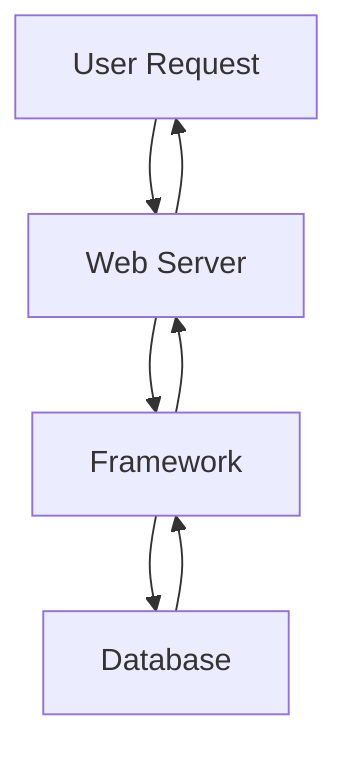
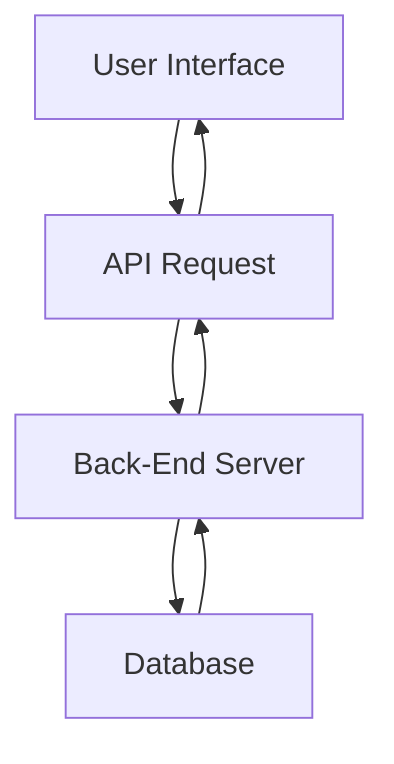

# What are Development Frameworks?

A **Development Framework** is a collection of pre-built code, libraries, tools, and structures that help developers build web applications faster and more efficiently.

Instead of creating everything from scratch, developers use frameworks that already provide common functionality such as:

- User Registration
    
- Authentication
    
- Sessions
    
- Database Connectivity
    
- Routing
    
- API Handling
    
- Security Features
    

### Simple Definition

> A development framework is a software toolkit that provides reusable components for building web applications quickly and securely.

---

# Why Use Frameworks?

Without frameworks:

```text
Developer
    ↓
Writes Everything Manually
    ↓
More Time
    ↓
More Bugs
```

With frameworks:

```text
Developer
    ↓
Uses Existing Components
    ↓
Faster Development
    ↓
More Reliable
```

---

# Framework Position in Web Architecture

```text
Browser
    ↓
Web Server
    ↓
Framework
    ↓
Database
```

---

## Framework Workflow



---

# Benefits of Development Frameworks

### Faster Development

```text
Pre-built Components
```

---

### Better Security

Built-in protections against:

- SQL Injection
    
- XSS
    
- CSRF
    

---

### Easier Maintenance

```text
Structured Code
```

---

### Scalability

```text
Easy Expansion
```

---

# Popular Development Frameworks

The HTB module mentions four common frameworks.

---

# Laravel (PHP)

## Overview

Laravel is one of the most popular PHP frameworks.

### Commonly Used By

- Startups
    
- Small Businesses
    
- Medium-Sized Companies
    

---

## Features

✅ Easy Development

✅ MVC Architecture

✅ Built-in Authentication

✅ Database ORM

✅ API Support

---

## Architecture

```text
Browser
    ↓
Apache/NGINX
    ↓
Laravel
    ↓
MySQL
```

---

# Laravel Visualization

---

# Express (Node.js)

## Overview

Express is the most popular framework for Node.js.

---

## Companies Using Express

- PayPal
    
- Yahoo
    
- Uber
    
- IBM
    
- MySpace
    

---

## Features

✅ Lightweight

✅ Fast

✅ JavaScript Everywhere

✅ REST API Friendly

---

# Express Architecture

```text
Browser
    ↓
NGINX
    ↓
Node.js
    ↓
Express
    ↓
MongoDB
```

---

# Django (Python)

## Overview

Django is a powerful Python framework.

---

## Companies Using Django

- Google
    
- YouTube
    
- Instagram
    
- Mozilla
    
- Pinterest
    

---

## Features

✅ Secure by Default

✅ Rapid Development

✅ ORM Support

✅ Admin Panel

---

# Django Architecture

```text
Browser
    ↓
NGINX
    ↓
Django
    ↓
PostgreSQL
```

---

# Rails (Ruby on Rails)

## Overview

Ruby on Rails is one of the oldest modern web frameworks.

---

## Companies Using Rails

- GitHub
    
- Hulu
    
- Twitch
    
- Airbnb
    
- Twitter
    

---

## Features

✅ Convention Over Configuration

✅ Rapid Prototyping

✅ MVC Pattern

✅ Strong Community

---

# Framework Comparison

|Framework|Language|
|---|---|
|Laravel|PHP|
|Express|Node.js|
|Django|Python|
|Rails|Ruby|

---

# Important HTB Point

Most large websites do NOT use a single framework.

Instead:

```text
Multiple Frameworks
+
Multiple Services
+
Multiple APIs
```

---

# APIs (Application Programming Interfaces)

## Definition

An **API** is a set of rules that allows applications to communicate with each other.

### Simple Definition

> APIs allow the front end and back end to exchange information and perform actions.

---

# Why APIs Exist

Without APIs:

```text
Front End
     ✖
Back End
```

No communication.

---

With APIs:

```text
Front End
      ↓
API
      ↓
Back End
```

Communication becomes possible.

---

# API Workflow



---

# Real World API Example

Weather Application:

```text
User Requests Weather
         ↓
API Request
         ↓
Weather Database
         ↓
JSON Response
         ↓
Display Weather
```

---

# API Visualization


---

# Query Parameters

Before REST APIs became common, web applications frequently used query parameters.

---

## GET Parameters

Example:

```http
/search.php?item=apples
```

---

### Breakdown

```text
/search.php
       ↓
Page

item
       ↓
Parameter

apples
       ↓
Value
```

---

# GET Request Example

```http
GET /search.php?item=apples HTTP/1.1
```

---

# POST Parameters

Sent within the HTTP body.

Example:

```http
POST /search.php HTTP/1.1

item=apples
```

---

# Query Parameter Flow

```text
User Input
      ↓
Parameter
      ↓
Back-End Processing
      ↓
Result
```

---

# REST APIs

## Definition

REST stands for:

```text
Representational State Transfer
```

---

## HTB Definition

REST APIs pass data through:

```text
URL Paths
```

instead of query parameters.

---

# Example

Traditional Query Parameter:

```http
/search.php?user=1
```

---

REST API:

```http
/users/1
```

---

# REST Structure

```text
/users/1
   ↓
Resource
   ↓
User ID 1
```

---

# Why REST is Popular

✅ Modular

✅ Scalable

✅ Easy to Understand

✅ Lightweight

✅ Works Well with JSON

---

# REST API Example

Request:

```http
GET /category/posts/
```

---

Response:

```json
{
  "100001": {
    "date": "01-01-2021",
    "content": "Welcome to this web application."
  },
  "100002": {
    "date": "02-01-2021",
    "content": "This is the first post on this web app."
  },
  "100003": {
    "date": "02-01-2021",
    "content": "Reminder: Tomorrow is the ..."
  }
}
```

---

# JSON Response Visualization

```text
Request
    ↓
REST API
    ↓
JSON Response
```

---

# REST HTTP Methods

HTB specifically highlights four methods.

---

## GET

Retrieve data.

Example:

```http
GET /users/1
```

---

### Action

```text
Read Data
```

---

## POST

Create data.

Example:

```http
POST /users
```

---

### Action

```text
Create New Resource
```

---

### Important

```text
Non-Idempotent
```

Multiple requests may create multiple records.

---

## PUT

Create or replace data.

Example:

```http
PUT /users/1
```

---

### Action

```text
Replace Resource
```

---

### Important

```text
Idempotent
```

Repeated requests produce the same result.

---

## DELETE

Delete data.

Example:

```http
DELETE /users/1
```

---

### Action

```text
Remove Resource
```

---

# REST Method Cheat Sheet

|Method|Action|
|---|---|
|GET|Read|
|POST|Create|
|PUT|Replace|
|DELETE|Remove|

---

# SOAP APIs

## Definition

SOAP stands for:

```text
Simple Object Access Protocol
```

SOAP exchanges data using:

```text
XML
```

---

# SOAP Workflow

```text
Client
    ↓
XML Request
    ↓
SOAP Service
    ↓
XML Response
```

---

# SOAP Example

```xml
<?xml version="1.0"?>

<soap:Envelope>
<soap:Header>
</soap:Header>

<soap:Body>
  <soap:Fault>
  </soap:Fault>
</soap:Body>

</soap:Envelope>
```

---

# SOAP Characteristics

✅ Structured Data

✅ Stateful Communication

✅ Complex Objects

✅ Enterprise Applications

---

### Drawbacks

❌ Complex

❌ Large Requests

❌ Harder for Beginners

❌ More Overhead

---

# SOAP vs REST

|Feature|SOAP|REST|
|---|---|---|
|Format|XML|JSON (usually)|
|Complexity|High|Low|
|Speed|Slower|Faster|
|Learning Curve|Harder|Easier|
|Scalability|Good|Excellent|
|Popularity|Lower|Very High|

---

# REST vs Query Parameters

### Query Parameter

```http
/search.php?item=apple
```

Parameter name included.

---

### REST

```http
/search/apple
```

Value passed directly through path.

---

# Complete API Request Flow

```text
User Clicks Button
         ↓
Front End Sends API Request
         ↓
Web Server Receives Request
         ↓
Framework Processes Request
         ↓
Database Query
         ↓
JSON Response
         ↓
Front End Displays Result
```

---

# Development Framework + API Relationship

```text
Browser
    ↓
API Request
    ↓
Framework
    ↓
Database
    ↓
Framework
    ↓
JSON Response
    ↓
Browser
```

---

# Important HTB Exam Points

### Remember

✅ Frameworks simplify web development.

---

✅ Common Frameworks:

|Framework|Language|
|---|---|
|Laravel|PHP|
|Express|Node.js|
|Django|Python|
|Rails|Ruby|

---

✅ API = Communication layer between front end and back end.

---

✅ Query Parameter Example:

```http
/search.php?item=apples
```

---

✅ POST Parameter Example:

```http
POST /search.php

item=apples
```

---

✅ REST Example:

```http
/users/1
```

---

✅ SOAP Uses:

```text
XML
```

---

✅ REST Uses:

```text
JSON
```

(Most commonly)

---

✅ REST Methods:

```text
GET
POST
PUT
DELETE
```

---

# Quick Revision (1 Minute)

```text
DEVELOPMENT FRAMEWORKS

Purpose:
Simplify Web Development

Frameworks:
• Laravel (PHP)
• Express (Node.js)
• Django (Python)
• Rails (Ruby)

--------------------------------

API

Purpose:
Connect Front End
and Back End

Types:
• Query Parameters
• SOAP
• REST

SOAP:
• XML
• Complex
• Stateful

REST:
• URL Paths
• JSON
• Scalable
• Most Popular

Methods:
GET    → Read
POST   → Create
PUT    → Replace
DELETE → Remove

Example:
/users/1
```
