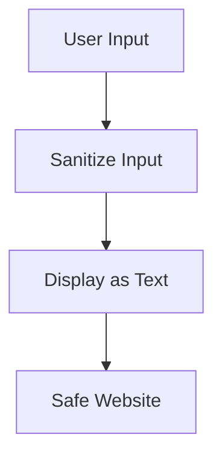
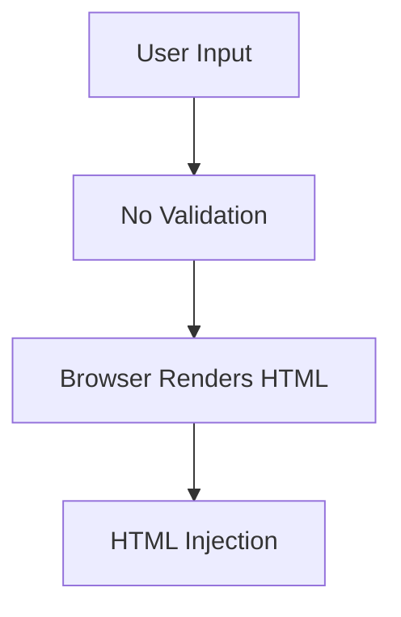

## What is HTML Injection?

**HTML Injection** is a vulnerability that occurs when an application displays **unsanitized user input** as HTML content in a webpage.

When user input is inserted into a page without proper filtering, attackers can inject their own HTML code that the browser interprets and renders.

### Simple Definition

> HTML Injection occurs when an attacker can insert arbitrary HTML code into a webpage because user input is not properly validated or sanitized.

---

## Why is HTML Injection Dangerous?

When attackers control displayed HTML, they can:

- Modify the appearance of a website
    
- Insert fake login forms
    
- Display malicious advertisements
    
- Redirect users to malicious websites
    
- Deface web pages
    
- Prepare the page for more dangerous attacks like XSS
    

---

## How HTML Injection Works

### Normal Flow

```text
User Input
    ↓
Application
    ↓
Displayed as Text
```

Example:

```html
Input: John
Output: Your name is John
```

---

### Vulnerable Flow

```text
User Input
    ↓
No Sanitization
    ↓
Browser Interprets HTML
    ↓
HTML Executes
```

Example:

```html
Input:
<h1>Hacked!</h1>

Output:
Hacked!
```

The browser renders the HTML instead of displaying it as text.

---

# Visual Overview

## Safe Application

```text
User Input
   ↓
Validation/Sanitization
   ↓
Display as Text
   ↓
Safe
```



---

## Vulnerable Application

```text
User Input
   ↓
No Filtering
   ↓
HTML Rendered
   ↓
HTML Injection
```



---

# Example Vulnerable Application

## Source Code

```html
<!DOCTYPE html>
<html>

<body>
    <button onclick="inputFunction()">
        Click to enter your name
    </button>

    <p id="output"></p>

    <script>
        function inputFunction() {

            var input = prompt(
                "Please enter your name",
                ""
            );

            if (input != null) {

                document.getElementById("output")
                    .innerHTML =
                    "Your name is " + input;

            }
        }
    </script>

</body>
</html>
```

---

## Vulnerable Line

```javascript
document.getElementById("output").innerHTML =
"Your name is " + input;
```

### Why?

The code uses:

```javascript
innerHTML
```

`innerHTML` tells the browser:

> "Treat whatever is inside as HTML."

So if the user enters HTML tags, they are rendered instead of displayed as plain text.

---

# Testing for HTML Injection

## Step 1

Click:

```text
Click to enter your name
```

---

## Step 2

Instead of entering a name, enter:

```html
<h1>HTB Academy</h1>
```

---

## Result

Displayed page:

```text
Your name is

HTB Academy
```

The browser renders the heading.

---

# Page Defacement Example

One common use of HTML Injection is website defacement.

### Payload

```html
<style>
body {
    background-color: red;
}
</style>
```

---

### Result

```text
Entire webpage background becomes red.
```

The attacker has modified the page appearance.

---

# HTB Example Payload

The course uses:

```html
<style>
body {
    background-image:
    url('https://academy.hackthebox.com/images/logo.svg');
}
</style>
```

---

### What Happens?

The CSS gets injected into the page.

The browser processes:

```css
body {
    background-image:
    url(...);
}
```

Result:

```text
HTB logo becomes webpage background.
```

---

## Visualization

### Before Injection


---

### After HTML Injection / Defacement


---

# Common HTML Injection Payloads

## Change Text

```html
<h1>Website Hacked</h1>
```

Result:

```text
Large heading displayed
```

---

## Change Text Color

```html
<h1 style="color:red;">
Hacked
</h1>
```

---

## Add Image

```html

```

---

## Add Fake Login Form

```html
<form>
Username:
<input type="text">

Password:
<input type="password">

<input type="submit">
</form>
```

Result:

```text
Fake login form appears
```

Attackers often use this for phishing.

---

## Add Hyperlink

```html
<a href="https://evil.com">
Click Here
</a>
```

---

## Change Background

```html
<style>
body {
    background:black;
}
</style>
```

---

# Difference Between HTML Injection and XSS

|HTML Injection|XSS|
|---|---|
|Injects HTML|Injects JavaScript|
|Changes page appearance|Executes scripts|
|Usually lower impact|Usually higher impact|
|Used for defacement|Used for account takeover, cookie theft|
|May lead to XSS|Directly executes code|

---

## HTML Injection Example

```html
<h1>Hello</h1>
```

Only HTML is rendered.

---

## XSS Example

```html
<script>
alert('XSS');
</script>
```

JavaScript executes.

---

# Root Cause

The vulnerability exists because:

```javascript
innerHTML
```

is used with untrusted input.

Example:

```javascript
element.innerHTML = userInput;
```

The browser interprets user input as HTML.

---

# Secure Alternative

Instead of:

```javascript
innerHTML
```

Use:

```javascript
textContent
```

Example:

```javascript
element.textContent =
"Your name is " + input;
```

---

### Difference

#### innerHTML

```javascript
element.innerHTML =
"<h1>Hello</h1>";
```

Output:

# Hello

(rendered heading)

---

#### textContent

```javascript
element.textContent =
"<h1>Hello</h1>";
```

Output:

```text
<h1>Hello</h1>
```

(displayed as text)

---

# Prevention

## 1. Validate User Input

Allow only expected characters.

Example:

```javascript
/^[a-zA-Z ]+$/
```

Only letters and spaces.

---

## 2. Sanitize Input

Remove dangerous tags:

```html
<script>
<style>
<iframe>
<object>
```

---

## 3. Use textContent

Preferred:

```javascript
element.textContent = input;
```

Avoid:

```javascript
element.innerHTML = input;
```

---

## 4. Server-Side Validation

Never trust client-side validation alone.

```text
Client Validation
      +
Server Validation
```

Both are required.

---

## 5. Encode Output

Convert:

```html
<
>
"
'
&
```

Into:

```html
&lt;
&gt;
&quot;
&#39;
&amp;
```

---

# Attack Chain

```text
User Input
    ↓
No Sanitization
    ↓
HTML Injection
    ↓
Page Defacement
    ↓
Fake Login Form
    ↓
Credential Theft
```

---

# Key Exam / HTB Points

### Remember

✅ HTML Injection = Unfiltered user input rendered as HTML

✅ Caused by improper input validation/sanitization

✅ Commonly occurs with:

```javascript
innerHTML
```

✅ Can lead to:

- Website defacement
    
- Fake forms
    
- Malicious links
    
- Social engineering attacks
    

✅ Testing Method:

```html
<h1>Test</h1>
```

If rendered as a heading → HTML Injection exists.

✅ Secure Alternative:

```javascript
textContent
```

instead of

```javascript
innerHTML
```

✅ Input should be validated and sanitized on:

- Front End
    
- Back End
    

---

# Quick Revision (1 Minute)

```text
HTML Injection
=
Displaying user input as HTML.

Cause:
innerHTML + No Sanitization

Impact:
• Defacement
• Fake Forms
• Malicious Links
• Reputation Damage

Test:
<h1>Test</h1>

Secure Fix:
textContent
+
Input Validation
+
Output Encoding
+
Server-side Sanitization
```

This covers all the important HTB concepts while preserving the key examples and payloads from the module.

