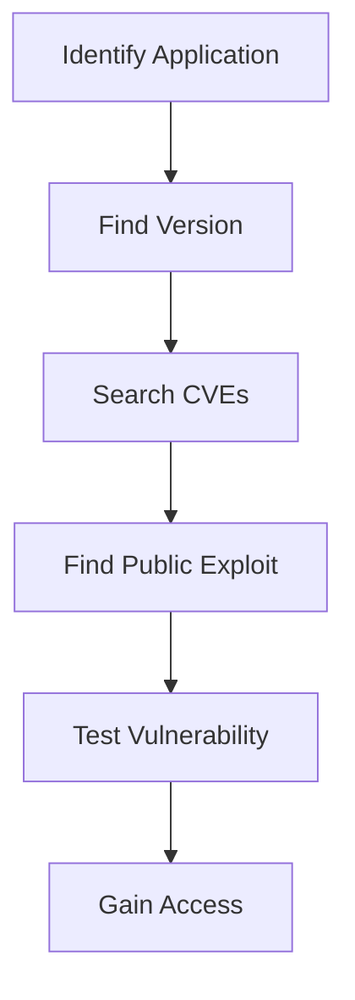

# What Are Public Vulnerabilities?

**Public Vulnerabilities** are security flaws that have been:

- Discovered by researchers
    
- Publicly disclosed
    
- Documented
    
- Assigned a CVE identifier
    
- Often accompanied by public proof-of-concept (PoC) exploits
    

These vulnerabilities may affect:

- Web Applications
    
- Web Servers
    
- Databases
    
- Plugins
    
- Frameworks
    
- Operating Systems
    

### Simple Definition

> A public vulnerability is a known security weakness that anyone can research, study, and potentially exploit if systems remain unpatched.

---

# Why Are Public Vulnerabilities Important?

In real-world penetration testing, checking for known vulnerabilities is usually one of the first tasks.

### HTB Important Concept

```text
Identify Target
      ↓
Identify Version
      ↓
Search Public CVEs
      ↓
Search Public Exploits
      ↓
Validate Vulnerability
```

Why?

Because exploiting a known vulnerability is often faster than discovering a new one.

---

# Public Vulnerability Workflow



---

# What is a CVE?

## CVE Definition

**CVE** stands for:

```text
Common Vulnerabilities and Exposures
```

A CVE is a unique identifier assigned to a publicly disclosed security vulnerability.

---

## CVE Format

Example:

```text
CVE-2025-12345
```

### Breakdown

```text
CVE
 ↓
Vulnerability Database

2025
 ↓
Year Assigned

12345
 ↓
Unique Identifier
```

---

# Why CVEs Matter

Without CVEs:

```text
Different Researchers
Different Names
Different References
Confusion
```

With CVEs:

```text
One Vulnerability
       ↓
One Universal Identifier
```

---

# Example

Instead of saying:

```text
WordPress Authentication Bug
```

Researchers can reference:

```text
CVE-2025-12345
```

and everyone knows the exact vulnerability.

---

# Why Public CVEs Exist

Organizations deploy:

- WordPress
    
- Joomla
    
- Drupal
    
- Plugins
    
- Frameworks
    
- Enterprise Applications
    

Millions of security researchers continuously test these products.

Result:

```text
Vulnerability Found
       ↓
Vendor Notified
       ↓
Patch Released
       ↓
CVE Assigned
       ↓
Public Disclosure
```

---

# Public Exploits

Many researchers release:

### Proof of Concepts (PoCs)

Small demonstrations proving a vulnerability exists.

---

### Exploit Code

Programs/scripts that automate exploitation.

---

# Why Pentesters Search Public Exploits First

HTB Important Point:

```text
Public Exploit Available
        ↓
Faster Validation
        ↓
Faster Compromise
```

---

# First Step: Version Identification

### HTB Exam Tip

Always identify:

```text
Application Version
```

before searching for vulnerabilities.

---

# Common Locations

### Source Code

```html
<meta name="generator"
content="WordPress 6.3">
```

---

### Footer

```text
Powered by Joomla 4.0
```

---

### Repository Files

```text
version.php
CHANGELOG
README
```

---

### HTTP Headers

```http
Server: Apache/2.4.49
```

---

# Vulnerability Discovery Process

```text
Application
      ↓
Version
      ↓
Google Search
      ↓
Exploit Database
      ↓
CVE Search
      ↓
PoC Review
```

---

# Popular Vulnerability Sources

## Exploit Database

Contains:

- Exploits
    
- PoCs
    
- Vulnerability Details
    

---

## Rapid7 Database

Contains:

- CVEs
    
- Metasploit Modules
    
- Vulnerability Information
    

---

## Vulnerability Lab

Contains:

- Security Research
    
- Disclosures
    
- Advisories
    

---

# Search Methodology

Example:

```text
WordPress 6.3 exploit
```

or

```text
WordPress 6.3 CVE
```

or

```text
Apache 2.4.49 RCE
```

---

# Don't Only Search the Main Application

HTB Important Point:

Search vulnerabilities for:

```text
Web Application
      +
Plugins
      +
Themes
      +
Frameworks
      +
Web Server
```

---

# Example

```text
WordPress
      ↓
Plugin
      ↓
Vulnerable Plugin
      ↓
Compromise
```

Even if WordPress itself is secure.

---

# CVSS (Common Vulnerability Scoring System)

## Definition

CVSS stands for:

```text
Common Vulnerability
Scoring System
```

---

# Purpose

Provides a standardized method for measuring:

```text
Severity
Risk
Impact
Exploitability
```

---

# Why Organizations Use CVSS

Organizations use CVSS to:

✅ Prioritize patching

✅ Allocate security resources

✅ Determine urgency

✅ Assess business risk

---

# CVSS Score Range

```text
0.0 → 10.0
```

---

# Severity Visualization

```text
0 -------------------- 10
│
├─ Low
├─ Medium
├─ High
└─ Critical
```

---

# CVSS Components

HTB highlights three metric groups:

```text
Base Metrics
Temporal Metrics
Environmental Metrics
```

---

# 1. Base Metrics

Measure the inherent characteristics of a vulnerability.

Examples:

- Attack Vector
    
- Attack Complexity
    
- Privileges Required
    
- User Interaction
    
- Confidentiality Impact
    
- Integrity Impact
    
- Availability Impact
    

---

# Base Metric Example

```text
Remote Code Execution
       ↓
High Base Score
```

---

# 2. Temporal Metrics

Measure changing characteristics over time.

Examples:

```text
Exploit Available?
Patch Available?
Exploit Maturity?
```

---

# Example

```text
No Exploit Exists
       ↓
Lower Risk

Public Exploit Released
       ↓
Higher Risk
```

---

# 3. Environmental Metrics

Measure impact on a specific organization.

Example:

```text
Same Vulnerability
```

---

### Hospital

```text
Patient Systems
      ↓
Very High Impact
```

---

### Test Lab

```text
No Critical Data
      ↓
Lower Impact
```

---

# CVSS v2 Ratings

|Severity|Score|
|---|---|
|Low|0.0 – 3.9|
|Medium|4.0 – 6.9|
|High|7.0 – 10.0|

---

# CVSS v3 Ratings

|Severity|Score|
|---|---|
|None|0.0|
|Low|0.1 – 3.9|
|Medium|4.0 – 6.9|
|High|7.0 – 8.9|
|Critical|9.0 – 10.0|

---

# Difference Between V2 and V3

### CVSS v2

```text
High
7.0 - 10.0
```

---

### CVSS v3

```text
High
7.0 - 8.9

Critical
9.0 - 10.0
```

V3 provides more granularity.

---

# HTB Important Pentesting Point

Generally prioritize:

```text
CVSS 8+
```

Especially:

```text
Remote Code Execution
(RCE)
```

---

# Why RCE Is Critical

```text
Remote User
       ↓
Execute Commands
       ↓
Gain Server Access
       ↓
Full Compromise
```

---

# Attack Prioritization

```text
Remote Code Execution
          ↓
Authentication Bypass
          ↓
Privilege Escalation
          ↓
Information Disclosure
```

---

# Back-End Server Vulnerabilities

Public vulnerabilities are not limited to web applications.

---

# Vulnerable Components

```text
Web Server
Database
Operating System
Framework
Plugin
Application
```

---

# Most Critical Back-End Target

### Web Servers

Because:

```text
Internet
    ↓
Directly Accessible
```

---

# Web Server Attack Flow

```text
Attacker
     ↓
Web Server
     ↓
Exploit Vulnerability
     ↓
Server Compromise
```

---

# Shellshock Example

One of the most famous web server vulnerabilities.

Affected:

- Bash
    
- CGI
    
- Apache environments
    

---

# Shellshock Attack Flow

```text
HTTP Request
      ↓
Bash Parses Input
      ↓
Command Executed
      ↓
Remote Code Execution
```

---

## Visualization


---

# Database Vulnerabilities

Usually exploited after:

```text
Initial Access
       ↓
Local Access
       ↓
Database Exploitation
```

---

# Goals

```text
Read Data
Modify Data
Steal Credentials
Privilege Escalation
```

---

# Operating System Vulnerabilities

Typically used after:

```text
Web Application Compromise
```

or

```text
Internal Network Access
```

---

# Example Attack Chain

```text
SQL Injection
      ↓
Web Shell
      ↓
Server Access
      ↓
Kernel Vulnerability
      ↓
Root Access
```

---

# Why Patch Internal Vulnerabilities?

HTB Important Point:

Even if not directly exploitable:

```text
Initial Access
      ↓
Internal Vulnerability
      ↓
Full Environment Compromise
```

---

# Pentester Methodology

```text
1. Identify Application
          ↓
2. Identify Version
          ↓
3. Search CVEs
          ↓
4. Search Plugins
          ↓
5. Search Frameworks
          ↓
6. Search Web Server
          ↓
7. Search OS Vulnerabilities
```

---

# Important HTB Exam Points

### Remember

✅ CVE = Common Vulnerabilities and Exposures

✅ CVSS = Common Vulnerability Scoring System

✅ First step:

```text
Identify Version
```

✅ Search:

- Application
    
- Plugin
    
- Framework
    
- Web Server
    

✅ Prioritize:

```text
CVSS 8+
```

✅ Highest Priority:

```text
Remote Code Execution
```

✅ CVSS Metrics:

```text
Base
Temporal
Environmental
```

✅ CVSS v3 Critical:

```text
9.0 – 10.0
```

✅ Shellshock:

```text
Web Server RCE
```

---

# Quick Revision (1 Minute)

```text
PUBLIC VULNERABILITIES

Definition:
Publicly known security flaws
with CVE identifiers.

Process:
Identify Version
      ↓
Search CVEs
      ↓
Search Exploits
      ↓
Validate

CVE:
Common Vulnerabilities
and Exposures

CVSS:
Common Vulnerability
Scoring System

Metrics:
• Base
• Temporal
• Environmental

Severity:
Low      0.1-3.9
Medium   4.0-6.9
High     7.0-8.9
Critical 9.0-10.0

Targets:
• Web Apps
• Plugins
• Frameworks
• Web Servers
• Databases
• Operating Systems

Highest Priority:
Remote Code Execution

Example:
Shellshock
→ Remote Command Execution
→ Server Compromise
```

This covers all HTB concepts while preserving the CVE process, CVSS scoring model, vulnerability prioritization, public exploit methodology, Shellshock example, and back-end server vulnerability workflow.