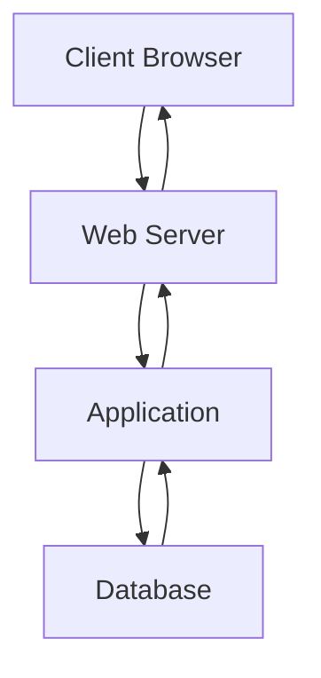

# What is a Web Server?

A **Web Server** is a software application running on a back-end server that:

- Receives HTTP/HTTPS requests from clients
    
- Processes those requests
    
- Routes requests to the correct resources
    
- Returns responses back to users
    

### Simple Definition

> A web server acts as the middleman between the user's browser and the web application's resources.

---

# Position in Web Architecture

```text
Client Browser
      ↓
Web Server
      ↓
Application Logic
      ↓
Database
```

The web server is the first component that receives requests from users.

---

# Web Server Workflow

## Step-by-Step Process

```text
1. User Requests Page
         ↓
2. Web Server Receives Request
         ↓
3. Server Processes Request
         ↓
4. Request Sent to Application
         ↓
5. Response Generated
         ↓
6. Web Server Returns Response
         ↓
7. Browser Displays Content
```

---

## Visualization



---

# Web Server Communication

Web servers usually communicate through:

|Protocol|Port|
|---|---|
|HTTP|80|
|HTTPS|443|

---

# Example

User enters:

```text
https://example.com
```

Browser sends:

```http
GET /
```

Web server receives request and responds:

```http
HTTP/1.1 200 OK
```

---

# Web Server Responsibilities

A web server performs many tasks:

### Request Handling

```text
Receive HTTP Requests
Receive HTTPS Requests
```

---

### Routing

```text
/ → Home Page
/login → Login Page
/profile → User Profile
```

---

### Static Content Delivery

Serves:

- HTML
    
- CSS
    
- JavaScript
    
- Images
    
- Videos
    

---

### Dynamic Content Processing

Processes:

- Logins
    
- Searches
    
- Forms
    
- API Requests
    

---

### Response Generation

Returns:

```text
HTML
JSON
XML
Files
Images
```

---

# Common HTTP Request Methods

|Method|Purpose|
|---|---|
|GET|Retrieve Data|
|POST|Submit Data|
|PUT|Update Data|
|PATCH|Partial Update|
|DELETE|Remove Data|

---

# HTTP Request Example

```http
GET /index.html HTTP/1.1
Host: example.com
```

---

# HTTP Response Example

```http
HTTP/1.1 200 OK
Content-Type: text/html
```

---

# Common HTTP Response Codes

Response codes tell the client what happened.

---

# Successful Responses

## 200 OK

```http
HTTP/1.1 200 OK
```

Meaning:

```text
Request Successful
```

---

# Redirection Responses

## 301 Moved Permanently

```http
HTTP/1.1 301 Moved Permanently
```

Meaning:

```text
Resource moved permanently
```

Example:

```text
oldsite.com
      ↓
newsite.com
```

---

## 302 Found

```http
HTTP/1.1 302 Found
```

Meaning:

```text
Temporary Redirect
```

---

# Client Error Responses

## 400 Bad Request

```http
HTTP/1.1 400 Bad Request
```

Meaning:

```text
Invalid Request Syntax
```

---

## 401 Unauthorized

```http
HTTP/1.1 401 Unauthorized
```

Meaning:

```text
Authentication Required
```

---

## 403 Forbidden

```http
HTTP/1.1 403 Forbidden
```

Meaning:

```text
Access Denied
```

---

## 404 Not Found

```http
HTTP/1.1 404 Not Found
```

Meaning:

```text
Resource Does Not Exist
```

---

## 405 Method Not Allowed

```http
HTTP/1.1 405 Method Not Allowed
```

Meaning:

```text
Method Disabled
```

Example:

```text
POST allowed
DELETE blocked
```

---

## 408 Request Timeout

```http
HTTP/1.1 408 Request Timeout
```

Meaning:

```text
Request Took Too Long
```

---

# Server Error Responses

## 500 Internal Server Error

```http
HTTP/1.1 500 Internal Server Error
```

Meaning:

```text
Unexpected Server Failure
```

---

## 502 Bad Gateway

```http
HTTP/1.1 502 Bad Gateway
```

Meaning:

```text
Invalid Response From Upstream Server
```

---

## 504 Gateway Timeout

```http
HTTP/1.1 504 Gateway Timeout
```

Meaning:

```text
Upstream Server Did Not Respond
```

---

# HTTP Status Code Cheat Sheet

|Code|Meaning|
|---|---|
|200|Success|
|301|Permanent Redirect|
|302|Temporary Redirect|
|400|Bad Request|
|401|Unauthorized|
|403|Forbidden|
|404|Not Found|
|405|Method Not Allowed|
|408|Timeout|
|500|Internal Error|
|502|Bad Gateway|
|504|Gateway Timeout|

---

# Visual HTTP Flow


---

# User Input Handling

Web servers process different data types.

---

## Text Data

```text
Username
Password
Comments
Search Queries
```

---

## JSON Data

Example:

```json
{
  "username":"admin",
  "password":"pass123"
}
```

Used by:

- APIs
    
- Mobile apps
    
- SPAs
    

---

## Binary Data

Examples:

```text
Images
Videos
Documents
PDF Files
```

---

# cURL and Web Servers

HTB demonstrates using:

```bash
curl
```

to communicate directly with web servers.

---

# Retrieve Headers

```bash
curl -I https://academy.hackthebox.com
```

---

### Example Output

```http
HTTP/2 200
content-type: text/html
```

Meaning:

```text
Page Exists
Request Successful
```

---

# Retrieve Source Code

```bash
curl https://academy.hackthebox.com
```

---

### Example Output

```html
<!doctype html>
<html>
<head>
<title>Cyber Security Training</title>
```

This displays the page source.

---

# Most Popular Web Servers

The HTB module focuses on:

1. Apache
    
2. NGINX
    
3. IIS
    

---

# Market Share Overview

```text
Apache ≈ 40%
NGINX ≈ 30%
IIS ≈ 15%
Others ≈ 15%
```

---

# Apache Web Server

## Overview

Apache (httpd) is the most widely used web server.

---

## Key Features

✅ Open Source

✅ Cross Platform

✅ Highly Customizable

✅ Extensive Documentation

✅ Large Community

---

# Apache Architecture

```text
Client
   ↓
Apache
   ↓
PHP
   ↓
MySQL
```

---

# Supported Languages

Apache supports:

- PHP
    
- Python
    
- Perl
    
- .NET
    
- Bash (CGI)
    

---

# Apache Modules

Functionality is extended using modules.

Example:

```text
mod_php
mod_ssl
mod_rewrite
```

---

# Popular Companies Using Apache

- Apple
    
- Adobe
    
- Baidu
    

---

# Apache Visualization


---

# NGINX

## Overview

NGINX is the second most popular web server.

Designed for:

```text
High Concurrency
High Performance
Low Resource Usage
```

---

# Why NGINX is Fast

Uses:

```text
Asynchronous Architecture
```

instead of creating many threads/processes.

---

## Benefits

✅ Low CPU Usage

✅ Low Memory Usage

✅ Handles Thousands of Connections

✅ Excellent Reverse Proxy

---

# NGINX Architecture

```text
Users
  ↓
NGINX
  ↓
Application Servers
```

---

# Popular Companies Using NGINX

- Google
    
- Facebook
    
- Twitter
    
- Cisco
    
- Intel
    
- Netflix
    
- Hack The Box
    

---

# NGINX Visualization


---

# IIS (Internet Information Services)

## Overview

IIS is Microsoft's web server.

Runs primarily on:

```text
Windows Server
```

---

# Main Use Cases

- ASP.NET Applications
    
- Enterprise Applications
    
- Active Directory Integration
    

---

# IIS Features

✅ Windows Authentication

✅ Active Directory Integration

✅ FTP Hosting

✅ .NET Support

---

# Active Directory Integration

Users can authenticate using:

```text
Domain Credentials
```

without creating separate accounts.

---

# IIS Architecture

```text
Windows Server
      ↓
IIS
      ↓
ASP.NET
      ↓
SQL Server
```

---

# Popular Companies Using IIS

- Microsoft
    
- Office 365
    
- Skype
    
- Stack Overflow
    
- Dell
    

---

# Other Web Servers

HTB also mentions:

---

## Apache Tomcat

Used primarily for:

```text
Java Applications
```

---

## Node.js

Used for:

```text
JavaScript Back-End Applications
```

---

# Apache vs NGINX vs IIS

|Feature|Apache|NGINX|IIS|
|---|---|---|---|
|Open Source|Yes|Yes|No|
|Operating System|Linux/Windows/macOS|Linux/Windows|Windows|
|Best For|General Use|High Traffic|Microsoft Ecosystem|
|PHP Support|Excellent|Excellent|Good|
|.NET Support|Good|Limited|Excellent|
|Active Directory|Limited|Limited|Excellent|
|Performance|High|Very High|High|

---

# Complete Request Lifecycle

```text
Browser
    ↓
Web Server
    ↓
Application
    ↓
Database
    ↓
Application
    ↓
Web Server
    ↓
Browser
```

---

# Important HTB Exam Points

### Remember

✅ Web Server = Handles HTTP/HTTPS Requests

✅ Default Ports:

```text
80  = HTTP
443 = HTTPS
```

✅ Common Status Codes:

```text
200 OK
301 Redirect
302 Redirect
400 Bad Request
401 Unauthorized
403 Forbidden
404 Not Found
405 Method Not Allowed
408 Timeout
500 Internal Error
502 Bad Gateway
504 Gateway Timeout
```

✅ Most Popular Web Servers:

1. Apache
    
2. NGINX
    
3. IIS
    

✅ Apache:

```text
Most Popular
Module-Based
PHP Friendly
```

✅ NGINX:

```text
High Traffic
Async Architecture
Low Resource Usage
```

✅ IIS:

```text
Windows
ASP.NET
Active Directory
```

---

# Quick Revision (1 Minute)

```text
WEB SERVERS

Definition:
Software that receives HTTP requests
and returns responses.

Ports:
80  = HTTP
443 = HTTPS

Functions:
• Receive Requests
• Route Traffic
• Serve Pages
• Return Responses

Popular Servers:
• Apache
• NGINX
• IIS

Common Status Codes:
200 OK
301 Redirect
302 Redirect
400 Bad Request
401 Unauthorized
403 Forbidden
404 Not Found
500 Internal Error
502 Bad Gateway
504 Gateway Timeout

Tools:
curl -I URL
curl URL

Other Servers:
• Apache Tomcat
• Node.js
```

These notes preserve all important HTB content while expanding it into a comprehensive, exam-focused study guide for Web Servers.